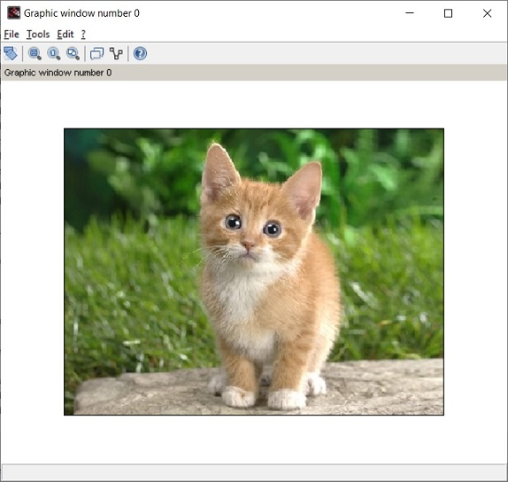

# sciTorch Module

Scilab Interface to libTorch

## Getting Started


### Prerequisites

1. Scilab 6.0.x

### Installing

The module could be easily install from the Scilab atoms portal by using command:

--> atomsInstall('sciTorch'); 

or the offline version by replacing the input argument to the zip file name.

If you prefer to build then module, download the source and unzip it, and download the libTorch for your OS from the PyTorch website (https://pytorch.org/) and extract the "include" and "lib" folder to put into the thirdparty folders as below:

SCI/contrib/sciTorch/thirdparty/libtorch/Linux/CPU/

After that, type in scilab:

```
--> exec("SCI/contrib/sciTorch/builder.sce")
```

If the module is place in the "contrib" folder, it could be loaded from the "Toolboxes" menu. Otherwise, just type in scilab:

``` 
--> exec("SCI/contrib/sciTorch/loader.sce"); 
```

SCI is the scilab root folder.

### EXAMPLES and DEMOS
 To see some examples type in scilab:

--> help 

```
// Simple example

S = imread(fullpath(torch_path() + "/demos/images/" + "cat.jpg"));
imshow(S);
```

```
model = torch_load(fullpath(torch_path() + "/demos/models/" + "sciGooglenet.pt"));
S2 = im2double(S);

m2 = torch_broadcast([0.485, 0.456, 0.406],S);
s2 = torch_broadcast([0.229, 0.224, 0.225],S);

// Normalized
S3 = (S2 - m2)./s2;

out = torch_forward(model,S3);

// Top-1
[V,I] = max(out);
str = mgetl(fullpath(torch_path() + "/demos/models/" + "classification_classes_ILSVRC2012.txt"));
disp(str(I));

// Top-5
[maxV,maxI] = gsort(out);
disp(str(maxI(1:5)));
```

## Current Features
* torch_broadcast — Variable Broadcasting
* torch_forward — Forward Pass
* torch_list — Loaded Models List
* torch_load — Load Torch Script Model
* torch_props — Network Architecture
* torch_unload — Unload Model from Scilab Workspace
* torch_unloadall — Unload All Model from Scilab Workspace

## Revisions

### REVISION NOTES 0.1.0
* Initial release 
* Integrating with pyTorch 1.3.1. 
* Work on Windows and Linux 
* Seamlessly integrated with Scilab IPCV module for image preprocessing and post processing.
  
## Future Plan
   * Training of the network
   * 
   * Translate blocks interfaces and error messages
   * Support for GPU
 

## Version

This is the Revision 0.1.0 of sciTorch Module for Scilab 6.0.x

## Authors

Tan Chin Luh 

## License

This program is free software; you can redistribute it and/or modify it under the terms of the GNU General Public License as published by the Free Software Foundation; either version 3 of the License, or (at your option) any later version.

This program is distributed in the hope that it will be useful, but WITHOUT ANY WARRANTY; without even the implied warranty of MERCHANTABILITY or FITNESS FOR A PARTICULAR PURPOSE.  See the GNU General Public License for more details.

You should have received a copy of the GNU General Public License along with this program; if not, write to the Free Software Foundation, Inc., 675 Mass Ave, Cambridge, MA 02139, USA.

## Acknowledgments

pyTorch forum members
